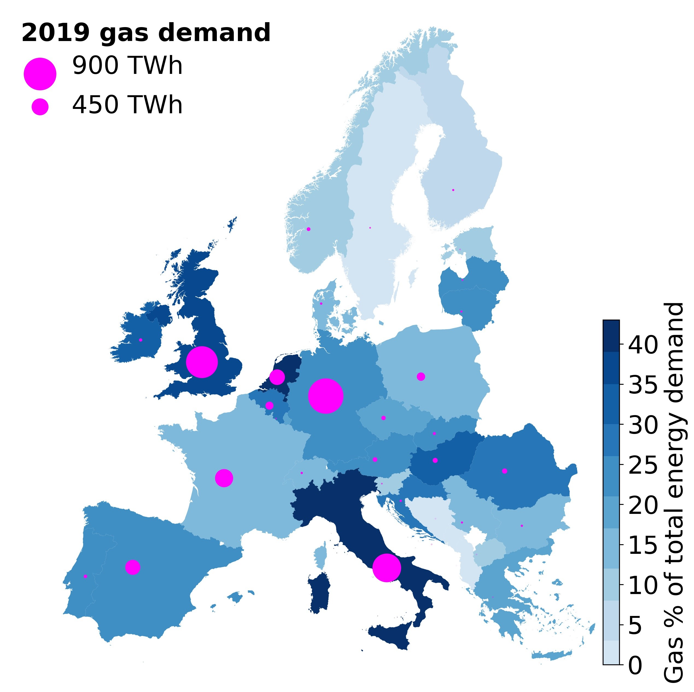

# natcol

This repository covers how to visualize national specific data by coloring the countries' land area according to the relevant value. Below is one example of the national gas consumption, a figure from the paper [Long-term implications of reduced gas imports on the decarbonization of the European energy system](https://doi.org/10.1016/j.joule.2022.06.023):

The script relies on the [Basemap](https://basemaptutorial.readthedocs.io/en/latest/first_map.html) module and the country shapefiles acquired from [gadm.org/](https://www.gadm.org/download_country_v3.html). Find the `environment.yml` for module versions used.
