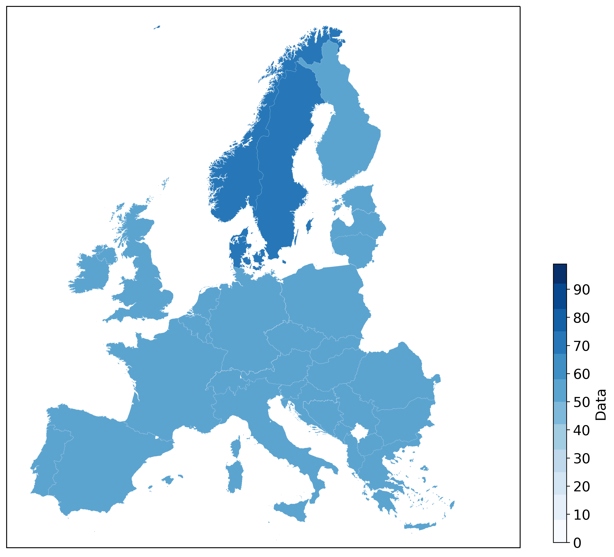

# natcol

This folders covers how to visualize national specific data by coloring the countries' land area according to the relevant value with Cartopy, since Basemap has been deprecated. See the example made with Cartopy below.

The script relies on the [Cartopy](https://scitools.org.uk/cartopy/docs/latest/matplotlib/intro.html) module and the country shapefiles acquired from [naturalearthdata/](http://www.naturalearthdata.com/) with the help of geopandas. The `environment_cartopy.yml` file contains the module versions used.
